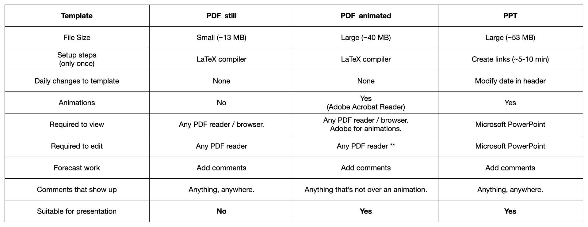

# cpex-aw_forecasting

Forecasting template and tools for creating daily weather forecasts for the CPEX-AW field experiment. 

To run the scripts in this directory, you will need to following:

1. ImageMagick (for image processing).
2. Python v3.x (I use 3.7.4) with following modules:
    - bs4 (HTML parsing)
    - datetime (dealing with dates)
    - numpy (number stuff)
    - os (reading existing files)
    - subprocess (executing code outside python)
    - urllib (retrieving images)
    - time
3. LaTeX compiler (for making pdf documents) or Microsoft Powerpoint.
4. Adobe Acrobat Reader (if creating PDF with animations).

Google Drive document with links and resources: https://docs.google.com/document/d/1R2nMAu8Cv7o2rpxjywCmUi2MQJwEco9a5HK3cPZZKkk/edit?usp=sharing

Google Drive directory for uploading forecasts: https://drive.google.com/drive/folders/17X7wae2wvQqRTcibPnCjBVleRFYAdFpC

-------------------------------------------
# Template Specifications

- Preview on Mac has worked well for me for both displaying and annotating PDF templates. 
-------------------------------------------
# Steps for automatically creating the LaTeX template

(This won't work unless your manual steps work.)
 - Before you run them for the first time, you will need to make the files executable (on Mac/Linux: chmod +x run_forecast_scripts.sh, chmod +x run_update_latest_imagery.sh)

1. **./run_forecast_scripts.sh** will run all the steps in the manual section **BUT**

 - You will need to open it up and edit a few things (instructions at the top of the .sh file)
    - Decide on steps you need to run for true/false switches. Best to keep 1-5 true, and only turn off LaTeX compilation step.
    - If you have a LaTeX compiler different from pdflatex, you will need to replace that (lines 71, 72, 78, 79)

2. Just before you present, **./run_update_latest_imagery.sh** will run the download and processing steps, but only for satellite imagery, which has probably been updated since the beginning of the forecasting. 
    - Download and processing is hardwired, but you can turn off PDF compilation.

 - NOTE: it assumes you have pdflatex to compile .tex files;
         it assumes you are operating in bash

-------------------------------------------
# Steps for manually creating the LaTeX template

These should be run from the main directory.

1. Archive previous day's images: **python ./supplementary/archive_yesterdays_images.py** 

This will take all the images from _./figs_final/_ and move them into a new directory, if they are not already saved. 
It will then remove all the images from -./figs/_, _./figs_cropped/_, and _./figs_final/_.

2. Download updated images for the forecast: **python ./supplementary/download_daily_images_master.py**

This will:
    - download images for the forecasting template. As long as not all images are available (i.e. some links did not work the first time), it will only download the missing images. If all images are present, it will re-download everything to update images to the last available time.
    - reports on status of images (e.g. tells you if they are not available).
    - saves all the available images in the _./figs/_ directory.

3. Create basic animations: **python ./supplementary/create_animations.py**

This will:
    - extend the last frame of each future animations by 3 frames, so a looping animation will stay longer at the last frame.

4. Crop, process, and annotate downloaded images: **python ./supplementary/crop_edit_daily_images.py**

This reads in _switches_process.txt_ that was created in 2. It's automatic, so no need for any changes. It:
    - adds the locations of St. Croix and Sal wherever applicable. 
    - crops images.
    - joins images together for animations.
    - creates final animations.
    - puts all intermediate imagery to _./figs_cropped/_.
    - puts all final imagery (for the .pptx template) to _./figs_final/_.

5. a) Run your latex compiler on one (or both) of the two scripts:
- forecast_template_still.tex  (run the compiler twice in a row for animations to work)
- forecast_template_animated.tex  (run the compiler twice in a row for animations to work)
to incorporate the newly downloaded images into a pdf template.

If you're running pdflatex, use the following syntax: **pdflatex --shell-escape --file-line-error forecast_template_animated.tex** (twice).

If a given image is not available at the time of pdf compilation, the templates will display the CPEX logo instead. For the animated template, the CPEX logo will display whenever the animation images are not complete.

6. Change the file name of your final forecast (whether it be .pdf or .ppt or .pptx) to follow this example: **CPEX-AW_Forecast_YYYY-MM-DD.pdf** and save in _./forecast_files/_. 
- e.g., on July 16, 2020, the file would be under name would be: ./forecast_files/CPEX-AW_Forecast_2020-07-16_animated.pdf

**Just before you are ready to present**
7. Update the observed imagery that might have been refreshed while you were forecasting: **./run_update_observed_imagrey.sh** or **python ./supplementary/update_observed_imagrey.py**
- this will only update NHC surface analysis, MIMIC-TPW imagery, GOES-16 and Meteosat-11, SAL split-window, and ICAP imagery.
- before it overwrites the images in ./figs_final/, it will copy the originals to *_backup*. So in case something is wrong with the latest imagery, you always have the option to go back to the original image. If you run the script multiple times, it will keep backups of each iteration.

The animations inside the PDF will only be displayed when you use Adobe Acrobat Reader to view the file. 
You can download it [here](https://get.adobe.com/reader/otherversions/).

-------------------------------------------
# Steps for creating the Microsoft PowerPoint template
Make sure you have downloaded image files and cropped them before starting this.

1. Copy the forecast_template_link.pptx file and rename it. Then open the new file. 

When you first open it, this will include a lot of messages that a specific image was not found. Proceed to step 2 (only needs to be done once after you download everything), but only after you've gone through the ./run_forecast_scripts.sh to have all the images downloaded and processed. (Or run the maual steps 1-4 from above, in that order).

2. You will need to set the links working on your personal computer. This might vary from machine to machine, or from one PowerPoint version to another. But in general, here's what you need to do **for each image in the template**:
- Click on the image and open the **Format picture** panel (Picture Format in top menu var, then Format Pane).
- Under **Shape Options**, click on **Fill and Line** tab (the one that looks like a paint bucket).
- Under the **Fill section**, make sure *Picture or texture fill* is chosen, and click on the **Insert ...**. button under *Picture source*. This will open a window where you can search for the image you want to link to. 
- Find the image you want to link (there's a list in _ppt_linked_images.txt_) and highlight it. All images for the ppt are stored in **/figs_final/**.
- Click on the **Options** button in the bottom left corner (this might vary), and tick both the **Link to File**, and the **Save with Document** boxes. 
- Click **Insert**.

As you add each new link, the empty figure should be replaced with what it is being linked to. As you go through the file, you will see the file size increase (from <500KB to >60MB).

**Preparing a forecast**

3. After downloading and processing new images (daily), open the forecast template PowerPoint file and check that the images have updated. For example, model images have a timestamp on the top right, you can check over there. Also compare with individual images in the _./figs_final/_ directory.

4. Go through and manually update all the dates that appear in titles. The dates in the footer (bottom left corner) will update automatically. 

5. Annotate the document with comments, highlights, summaries, etc.

6. After you are done with annotations (or ~20 min before presenting), run the script to refresh observed imagery (**./run_update_latest_imagery.sh**). This way your document will include the latest available observations.

7. Copy (or Duplicate) the finished PPT file, and name it following this example: **CPEX-AW_Forecast_YYYY-MM-DD.pdf**
- e.g., on July 16, 2020, the file would be under name would be: ./forecast_files/CPEX-AW_Forecast_2020-07-16_animated.pdf

8. Move the final document to **./forecast_files/**.

9. This should be it. But just to double-check that everything has been linked correctly:
- Transfer the finalized PPT file to someone else's computer (like the second forecaster). Since the file is large, you can do it through Google Drive (virtually), or through a thumb drive (manually). 
- Check that all images appear on a second computer. 
    - If they do, then you've properly linked and saved all images with the file. Great job!
    - If they do not, go back to your original template, and re-link the missing files. Then repeat steps 7-9 until there's no more missing images.

9. Once you have confirmed that the saved file is as it should be on more than just your machine, upload the entire template (size should be > 50MB) to Google Drive (https://drive.google.com/drive/folders/17X7wae2wvQqRTcibPnCjBVleRFYAdFpC), and we will move it to the online repository.

